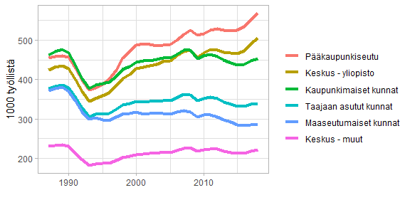

# Aggregate municipality data

Load packages


```r
library(statfitools)
library(dplyr)
```

```
## 
## Attaching package: 'dplyr'
```

```
## The following objects are masked from 'package:stats':
## 
##     filter, lag
```

```
## The following objects are masked from 'package:base':
## 
##     intersect, setdiff, setequal, union
```

```r
library(ggplot2)
```

```
## Registered S3 methods overwritten by 'ggplot2':
##   method         from 
##   [.quosures     rlang
##   c.quosures     rlang
##   print.quosures rlang
```

```r
library(forcats)
```

Get data from the Statistics Finland and clean variable names and time variable.


```r
# 115b -- Väestö alueen, pääasiallisen toiminnan, sukupuolen, iän ja vuoden mukaan, 1987-2017

pxweb::pxweb_get("http://pxnet2.stat.fi/PXWeb/api/v1/fi/StatFin/vrm/tyokay/statfin_tyokay_pxt_115b.px")
```

```
## PXWEB METADATA
## Väestö alueen, pääasiallisen toiminnan, sukupuolen, iän ja vuoden mukaan muuttujina Alue, Pääasiallinen toiminta, Sukupuoli, Ikä, Vuosi ja Tiedot 
## variables:
##  [[1]] Alue: Alue
##  [[2]] Pääasiallinen toiminta: Pääasiallinen toiminta
##  [[3]] Sukupuoli: Sukupuoli
##  [[4]] Ikä: Ikä
##  [[5]] Vuosi: Vuosi
##  [[6]] Tiedot: Tiedot
```

```r
dat_ku <- pxweb::pxweb_get_data(
    url = "http://pxnet2.stat.fi/PXWeb/api/v1/fi/StatFin/vrm/tyokay/statfin_tyokay_pxt_115b.px",
    query = list(Tiedot = c("lkm"),
                 Alue = c('*'),
               "Pääasiallinen toiminta" = c('11'),
               Sukupuoli = c('SSS'),
               "Ikä" = c('SSS'),
               Vuosi = c('*'))) %>% 
  clean_names(rename_values = TRUE) %>% 
  clean_times()
```

Aggregate data using classification "Keskuskuntaryhma" included in the package. 


```r
dat_keskuskunta <- dat_ku %>% 
  # Remove whole country group
  filter(Alue != "KOKO MAA") %>%
  # Join with codes. Codes are not included in the data.
  mutate(ku_code = sf_name2code(Alue, class = "kunta", year = 2016)) %>%  
  left_join(keskuskuntaryhma_key, by = c(ku_code = "Knro")) %>%
  # Aggregate
  group_by(Keskusryhma, time, Paaasiallinen_toiminta) %>% 
  summarise(values = sum(values, na.rm = TRUE)) %>% 
  ungroup()
```

```
## Warning: Column `ku_code`/`Knro` joining factors with different levels,
## coercing to character vector
```

Plot the data. Groups are ordered based on last value.


```r
ggplot(dat_keskuskunta, 
       aes(time, values/1000, 
           colour = fct_reorder2(Keskusryhma, time, values))) +
  geom_line(size = 1.5) +
  guides(colour = guide_legend("")) +
  ylab("1000 työllistä") + xlab("") +
  theme_light()
```

<!-- -->

